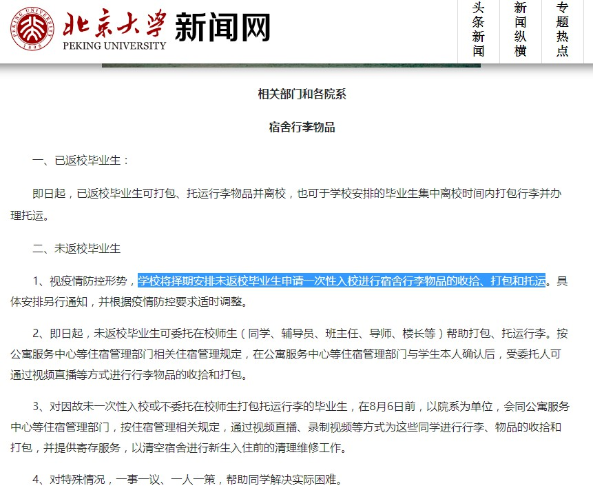

## 0625

共4个文件，[在网页中查看](https://flyerwg.github.io/bit_move_dorm/0625/)，[在Github中查看](https://github.com/flyerwg/bit_move_dorm/tree/master/0625/)

* [北大允许返校通知](#北大允许返校通知)
* [希望学生要有大局和总体观念](#希望学生要有大局和总体观念)
* [强调工作量](#强调工作量)
* [等学校通知](#等学校通知)

### 北大允许返校通知

文件大小：136.8 KB，[下载](https://flyerwg.github.io/bit_move_dorm/0625/北大允许返校通知.jpg/)，[在Github中查看](https://github.com/flyerwg/bit_move_dorm/tree/master/0625/北大允许返校通知.jpg/)

### 希望学生要有大局和总体观念

文件大小：21.0 KB，[下载](https://flyerwg.github.io/bit_move_dorm/0625/希望学生要有大局和总体观念.jpg/)，[在Github中查看](https://github.com/flyerwg/bit_move_dorm/tree/master/0625/希望学生要有大局和总体观念.jpg/)

### 强调工作量

文件大小：9.57 KB，[下载](https://flyerwg.github.io/bit_move_dorm/0625/强调工作量.jpg/)，[在Github中查看](https://github.com/flyerwg/bit_move_dorm/tree/master/0625/强调工作量.jpg/)

### 等学校通知

文件大小：16.2 KB，[下载](https://flyerwg.github.io/bit_move_dorm/0625/等学校通知.jpg/)，[在Github中查看](https://github.com/flyerwg/bit_move_dorm/tree/master/0625/等学校通知.jpg/)

