# 2020年北京理工大学强制将毕业生宿舍行李物品寄走事件

    

查看网页版：[https://flyerwg.github.io/bit_move_dorm/](https://flyerwg.github.io/bit_move_dorm/)

下载以便离线阅读：[最新版](https://github.com/flyerwg/bit_move_dorm/releases/latest) [历史版本](https://github.com/flyerwg/bit_move_dorm/releases)

* [PDF - 仅首页](https://github.com/flyerwg/bit_move_dorm/releases/download/v1.1.1/bit_move_dorm_1_1_1_home.pdf)
* [网页 - 完整版](https://github.com/flyerwg/bit_move_dorm/releases/download/v1.1.1/bit_move_dorm_1_1_1_full.zip)
* [网页 - 仅小文件](https://github.com/flyerwg/bit_move_dorm/releases/download/v1.1.1/bit_move_dorm_1_1_1_size_reduced.zip)
* [网页 - 仅图片](https://github.com/flyerwg/bit_move_dorm/releases/download/v1.1.1/bit_move_dorm_1_1_1_image_only.zip)
* [项目文件打包](https://github.com/flyerwg/bit_move_dorm/archive/master.zip)

注：部分内容整理自[知乎](https://www.zhihu.com/)、[微博](https://weibo.com/)、同学群、问题反馈群的相关讨论

## 目录

* [事件经过](#事件经过)
  * [6月18日 周四](#6月18日-周四)
  * [6月19日 周五](#6月19日-周五)
  * [6月20日 周六](#6月20日-周六)，[相关证据](0620/)
  * [6月21日 周日](#6月21日-周日)，[相关证据](0621/)
  * [6月22日 周一](#6月22日-周一)
  * [6月23日 周二](#6月23日-周二)
  * [6月24日 周三](#6月24日-周三)
  * [6月25日 周四](#6月25日-周四)，[相关证据](0625/)
  * [6月28日 周日](#6月28日-周日)，[相关证据](0628/)
  * [6月29日 周一](#6月29日-周一)，[相关证据](0629/)
  * [6月30日 周二](#6月30日-周二)
  * [7月1日 周三](#7月1日-周三)，[相关证据](0701/)
  * [7月2日 周四](#7月2日-周四)
  * [7月3日 周五](#7月3日-周五)，[相关证据](0703/)
  * [7月4日 周六](#7月4日-周六)
  * [7月5日 周日](#7月5日-周日)
* [可行性分析](#可行性分析)
* [已经邮寄的其他学校的情况](#已经邮寄的其他学校的情况)，[相关证据](其他/)
* [相关讨论](#相关讨论)
* [总结](#总结)
* [反馈渠道](#反馈渠道)
* [贡献方式](#贡献方式)

## 事件经过

### 6月18日 周四

下午3点，物理学院开了第一次会，通知各班开始以寝室为单位着手准备行李邮寄事宜。

具体内容是：由留校的研究生、教职工帮助同学打包，同学视频指挥，一周之内完成，学校要求是六月底之前完成。

随后在提问过程中，同学提到了以下几个问题：

1. 为什么要在六月底之前将所有物品搬出宿舍？  
答复为：之后宿舍要启用。
2. 如果宿舍启用，有学生入住，那么为什么不能由学生本人返校自行收拾行李？  
答复为：往年都是这个时间清宿舍。
3. 今年疫情特殊情况下，为什么要跟往年同步？退一步说，往年学生还在学校，这个解释不合理。  
答复为：学校规定。
4. 为什么要让老师学长去搬？  
答复为：学校封锁，外来人员不能入内，各学院只能自行解决。
5. 能否在有新生入住前将物品置于宿舍中？  
答复为：不能，宿舍为学校统一规划，月底前必须清空。
6. 如果只能邮寄行李，那么邮寄过程中出现损毁如何处理  
**这个问题始终没有得到正面回答，负责的导员开始卖惨，说学生不体谅学院工作。**  
在没有得到任何有价值的答复的情况下，学生要求和学校有关负责人了解情况，得到的答复是：没有联系方式。

随后各班会议在没有任何结果的情况下结束。在学院群中，学生开始自行组织了解情况，并分发调查[问卷](https://www.wjx.cn/jq/82292025.aspx)，并将收到的通知告知其他学院。

有同学在知乎上进行提问：[如何看待北京理工大学强制将毕业生物品寄走？](https://www.zhihu.com/question/402154042)
* 注：目前该问题已被锁定

两个小时后，学院书记王晶晶通知再次开会，解答问题。**此后的两次会议，都有全程录音。**

晚上7点，第二次会议。

* 对前三个问题，仍然没有给出任何合理的解释。
* 对可否将物品留在宿舍的问题，回复改为：可以打包不邮寄，但**仍需在月底前清空宿舍，没有任何合理的解释（该说法在第三次会议中被学工部副部长周明宇否定）**。但考虑学生需求，给出了很多可选项：包括自行到校门口取走物品，由学院统一保管到学校解除封锁后自行提取。
* 对邮寄过程中出现损毁丢失如何处理，回复改为：学院保证物流的可靠性，贵重物品将列清单，尽量保证个人财产。

19:53 学院书记王晶晶提到有人在知乎上提问，说学校给了“很大的压力”，向学生询问有无线索，并且对在场的学生进行挨个点名，询问是否为问题发起者。

此后有长达将近20分钟的时间，学生反复询问是否能够与上级领导进行沟通，而每次都被转移话题。最终学院书记王晶晶实在没办法，才同意允许学生直接和领导沟通。

晚上8点，第三次会议，换学工部副部长周明宇来解答问题。

对之前的问题，答复又变了，称：**从来没有说过强制清空宿舍或强制邮寄个人物品，遵循自愿的原则，至少在七月中旬前可以将个人物品留着宿舍内，这之后，根据疫情发展情况，如果可以返校，那么学生可自行打包行李，如果仍然处于封锁状态，而学校需要启用宿舍，那么将会提前通知，再做处理（包括寄存和邮寄的方式）**。

对于物品丢失损毁的问题，承诺邮寄过程中保值保价，若在打包和搬运过程中发生损坏，是学校的责任学校肯定会赔偿，**但始终没有给出具体如何认定是否为学校的责任，也没有给出具体的赔偿方案**。

学工部副部长周明宇表示，**出现这些问题，是沟通不顺畅导致的**，大家有意见可以通过沟通解决。

至此，知乎上最初的几个帖子都修改为：问题基本解决。

### 6月19日 周五

这一天相对缓和，但从其他学院的同学那里了解到，仍然有一些学院要求学生强制搬走。

### 6月20日 周六

知乎上有同学提到出现了老师给家长打电话要求强制装包的情况（未证实），学工部副部长周明宇表示不应该出现这种事情。此外，还了解到法学院老师仍然通知不能放宿舍，并且挨个打电话通知，态度很强势。

同学做了面向全校的[问卷](https://www.wjx.cn/jq/82522887.aspx)，了解各个学院的情况。

学院书记王晶晶表示，**具体的安排通知会在下周一二（22到23日）出来（事实上没有出来）**。

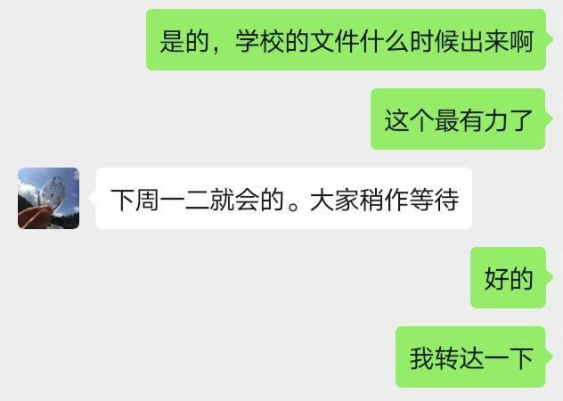

晚上，知乎问题被锁定，并且有少量答案被删除。

* [截图备份](0620/%E7%9F%A5%E4%B9%8E%E5%9B%9E%E7%AD%94.pdf)（[省流量版本](0620/%E7%9F%A5%E4%B9%8E%E5%9B%9E%E7%AD%94_%E7%BC%A9%E5%B0%8F%E6%96%87%E4%BB%B6%E5%A4%A7%E5%B0%8F.pdf)）
* 共99个回答，298个关注着，16万浏览，锁定后被删除大约10个答案

### 6月21日 周日

对于法学院老师仍然通知不能放宿舍的情况，学工部副部长周明宇表示法学院已经沟通过了，如果该学生还有疑问，可以咨询他们学院副书记马晓龙。

然而，此后学工部副部长周明宇的态度发生了微妙的变化。

* 先是说物品可以暂存。是否能够存在宿舍里，根据宿舍的拟使用情况定。
* 之后又变成了**有诉求的同学去个别申请**吧，讲清楚原因，批准后选择暂存宿舍。这**可能是**解决这个问题的办法。
* 还表示，自愿将行李暂存宿舍不是针对所有学生的，不要把这个作为政策传达给所有学生（之前会议中说的是可以作为政策传达给所有学生）。

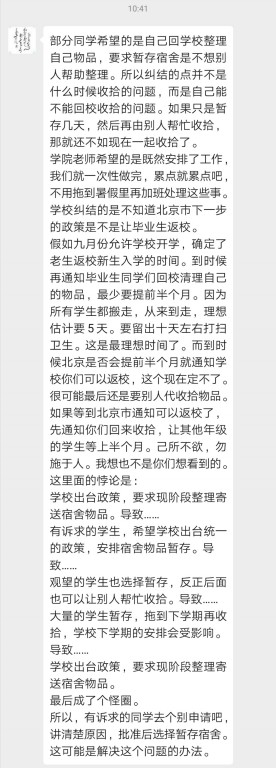 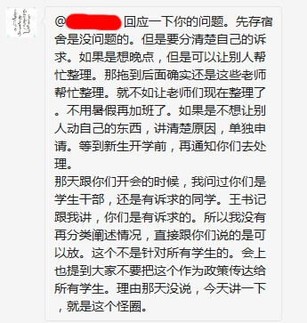

当问及关于工作量的问题时（因为我们认为在短时间内不可能来得及打包完，最后为了工作效率肯定会产生很多损坏），学工部副部长周明宇承认**在今年疫情下，人手肯定不足，不是说提高效率，就可以几天完成的**，但并没有提及如何解决该问题。

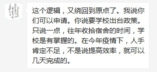

学院书记王晶晶还表示，**学院的方案开始就是按照分情况分批次计划的（事实上之前没有老师或领导提到过）**。

### 6月22日 周一

这几天学生主要都在等待学院的正式通知，因此没有很多讨论。

下午1班组织的德育答辩中，学生并没有主动提出搬宿舍的事情，总结的时候学院书记王晶晶却责怪学生，说不是所有的便利都理所当然，不要把自己遇到的困难迁怒于别人，老师感到非常伤痛。

这引起了同学们的极大不满，有同学对学院书记王晶晶的评价是：什么时候真的关心过我们的生活了？除了会在某些时刻说点体面话之外还干过什么？一条体制内的蛆虫罢了，踩着学生的头慢慢爬上去吧。

### 6月23日 周二

下午，2班和3班组织的德育答辩中，不知道是不是因为受到同学们之前在群里讨论的影响，学院书记王晶晶没有再阴阳怪气，只是正常地解答了同学们的问题，但是态度相比以前发生了微妙的转变：

* 多次打断班主任的讨论，尤其是关于同学们的3种选择（保存在宿舍、保存在学院、打包寄回来），**不禁让同学怀疑，自愿选择留存宿舍的选项是否已经不再可行**。
* **是否有书面通知并不明确（之前说的是周一二会出，但是并没有出），是否有公开统计也并不明确**。
* 很可能是没有具体方案，然后一个一个单独统计。同学们认为这是给大家制造了囚徒博弈，试图逐个击破的策略。
* 正常的程序是这周登记，下周收拾、邮寄。

晚上，陆陆续续有同学开始接到老师的电话，询问关于是否同意邮寄行李以及贵重物品登记。

* 邮寄时间推迟为7月1日到7日，由学校集中办理。
* 会招募一些研究生和保洁人员参与打包。
* 当问及是否能够将行李留在宿舍时，得到的答复是：可以，但十分不建议。

当天，宇航学院以一个本科女生宿舍为试点，在宿舍全体成员的同意下，实地验证方案可行性，为接下来实现“一人一策”的人性化搬家工作提供指导。相关推送：[宇航学院版直播“带”货，将关心与牵挂整理打包](https://mp.weixin.qq.com/s/Ai5gvYl6hbCIcd0rjj2aZw)。从中可以看出以下几点信息：

* 一个宿舍有4位同学，需要大约6个老师干一天，也就是每个同学需要 1.5老师\*天。
* 这个宿舍东西没有特别多，并且是几个领导带头有准备地进行打包，并且只工作了1天。
  * 因此实际在估算工作量的时候，可以按照每个同学大约需要2老师\*天来进行
* 共消耗纸箱20个，行李箱7个，大袋子3个。

### 6月24日 周三

这一天老师继续单独给每位同学打电话询问需求。当问及关于人手和时间是否充足时，得到的答复是，不可能达到每个同学能有2老师\*天的程度，也就是说实际的人手和时间是不够的。此外，老师还提到会聘请一些保洁人员参与行李的打包，但仍然没有明确物损的责任认定问题。

北理在官方网站发布[北京理工大学2020届毕业生行李寄运服务校级评比公告](http://www.bit.edu.cn/tzgg17/ggxx/187458.htm)，采购内容为“提供行李打包的纸箱等耗材，在约定时间将毕业生行李寄运到指定地点…”，预算为92万元。

### 6月25日 周四

晚上，有同学在群里提到说，北大发的通知中提到**学校会根据情况给毕业生申请进入学校收拾行李的机会**，相关新闻如下：

* [北大发布 关于2020年毕业相关工作的通知](http://news.pku.edu.cn/xwzh/decf2d62f1f8434ab55798ac203f762d.htm)
* [毕业离校日程安排出炉！北大，期待与你重逢](https://mp.weixin.qq.com/s/vnzGtw0R-v5WTdcdCX8P7Q)

当问及**如果北大的学生能够返校，北理的学生是否也可以**时，学院书记王晶晶先是强调老师的工作量，再希望学生要有大局和总体观念、把更多精力放在自己如何为此贡献和尽力，还给出了[关于北京高校学生停止返校的通知](https://xw.qq.com/partner/standard/20200617A002DC/20200617A002DC00?ADTAG=standard&pgv_ref=standard)，但事实上**允许部分学生返校，帮助老师和同学打包行李，本身就是一种贡献**，并且**北大也不会在违背北京市要求的情况下出台这个政策的**。最终，学院书记王晶晶表示，等学校通知就好。在此期间，学工部副部长周明宇未参与讨论。

### 6月28日 周日

上午，2班班主任吕勇军和辅导员开始私聊学生发[搬家协议和委托书](0628/致物理学院2020届毕业生的一封信(1).pdf)，其中**提到了可以暂存学校的选项，但是没有提到可以留存宿舍，委托书中没有出现物损赔偿相关的内容**。老师表示，**东西可以放在学校，但也要打包集中代存，若不签这个协议，学校会有统一的处理办法，但现在还不明确**。

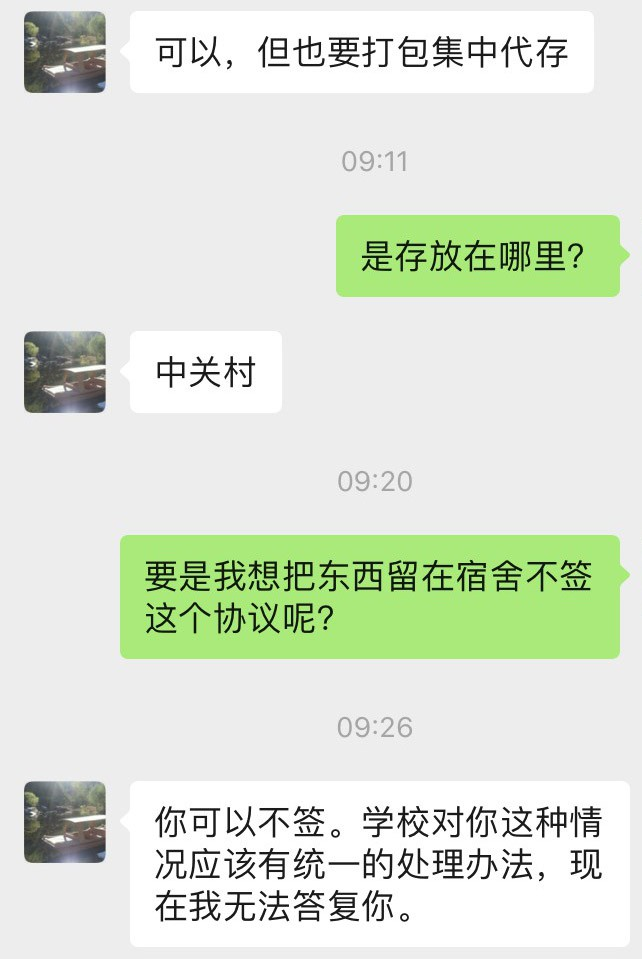

对此，同学们继续询问相关负责人，学院书记王晶晶的答复是**集中暂存，如有特殊困难，可以单独和你的联系老师反馈**，而学工部副部长周明宇的答复是**不同意打包就是放宿舍，自愿选择**。

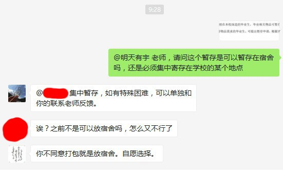

也就是说，关于行李是否能够留存宿舍，各个老师的说法之间仍然存在相互矛盾。

晚上，2班班主任吕勇军表示，学院明天（29日）就要人员分配，后天（30日）正式着手做了。

### 6月29日 周一

下午，3班班主任郭伟在班群内发送了[委托书](0629/1、委托办理离校相关事项登记表.docx)，并表示委托部分请**每个同学根据自己的意愿填写**。要求明天（30日）晚上之前提交，预计7月2号开始收拾宿舍东西。

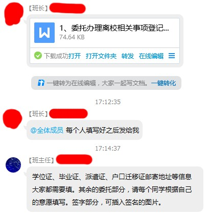

### 6月30日 周二

中午，学院书记王晶晶表示，学院将组织老师们7月2日开始代收代寄同学们的物品行李。这期间有任何问题，请直接与你对接沟通的老师反馈。

### 7月1日 周三

这两天各班班主任和辅导员为每个宿舍建群，方便打包时进行视频确认。

下午，2班主任吕勇军发布代存代寄通知，表示明天（2日）早上正式为大家代存代寄。

学校发布了一个毕业相关的通知[永驻心间！北理工毕业季系列活动精彩来袭～](https://mp.weixin.qq.com/s/Wr9AVa6_157oDaganZYBBw)，其中提到行李打包的时间安排为7月1日-7月12日。

晚上，学院书记在群里发了搬宿舍相关通知，主要有以下几点信息：

* 关于时间安排
  * 预计本科生2-3号打包完成（之前学院通知的是1-7号，学校1-12号）。
  * 具体每个宿舍的时间尚未确定。
  * 从明天（2号）上午开始（**晚上通知第二天上午**）。
* 关于人手安排
  * 每个宿舍3-4人，半天时间（这肯定来不及）。
* 关于贵重物品
  * 贵重物品和大宗行李分开，大宗行李学校统一邮寄和寄存，贵重物品学院单独打包邮寄和寄存。
  * 一些危险品和贵重物品都被认为是快递违禁品，不可邮寄，可以由学院保管。
  * 始终没有提到留存宿舍的选项。

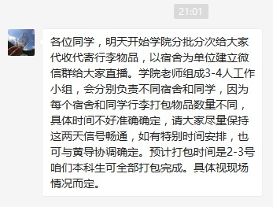 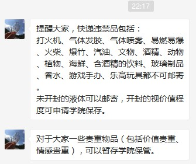 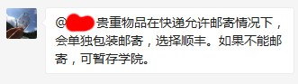 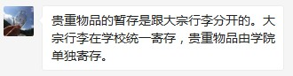

### 7月2日 周四

老师和学生开始以微信视频通话的形式直播打包过程，少数宿舍使用腾讯会议。

* 人手和速度情况：每个宿舍4个老师或学生，平均消耗半天时间。
* 宿舍网络不稳定，有些同学视频通话质量较高，有些存在明显的卡顿和模糊。
* 不少宿舍的打包情况还是比较满意的，但是仍然有一些老师存在以下情况：
  * **并不按要求打包，学生要求扔掉的东西也被一起打包，贵重物品（在委托书中声明过的）没有分开单独打包**。
  * 可以看出有因为劳累等原因导致的轻度不耐烦倾向，但是一直在努力克制着，以至于在和你对话表现出的耐心有一种格格不入感。
* 2班同学并不知道存在留存宿舍的选项，以为只能寄存。
* **一些贵重物品在打包过程中由于操作不当而导致损坏，例如内存卡扣**。
* 张军校长来寝室视察过，但没有询问具体情况，只是跟收拾的老师说你们辛苦了。
* 关于快递选择：
  * 打包使用的是邮政包裹的纸箱。
  * 联系过顺丰和京东，但最终选择申通进行邮寄，因为申通最便宜。
  * 未提到保价的事情。

### 7月3日 周五

老师继续给学生打包行李。

* **发生了多起证件、证书、奖状、成绩单丢失的情况**。
  * 在与老师协商的过程中，老师并没有帮助解决问题，而是表示自己已经寒心了。
* 出现了**很多贵重物品（手办、香水等）被遗留在宿舍内没有被打包**的情况。
* **很多贵重物品（电子产品、鞋子等）的包装被拆开并直接丢弃，导致了发票、保修卡等重要物品的丢失以及物品本身的折旧**。
* 有宿舍的物品打包较为混乱。
  * 出现了**将多个同学的物品打包进了同一个箱子**的情况。
  * 快递揽件过程中出现了部分包裹重新打包的情况，在重新打包的过程中发生错误。
  * 少数同学的包裹**直接出现邮寄地址填错**的情况。
* 有些宿舍的老师**未与学生进行全程视频通话，而是根据自己的想法进行打包，只是与学生进行简单的文字交流**，导致了很多错误的发生。
* 有些老师到后期非常不耐烦，**直接丢弃学生的物品，表示“你反正也用不上了，不用要了”**，令学生非常不满。
* 后期还出现了打包物资不足的情况，例如没有泡沫纸了。
* 总体而言，3班的同学满意度最高，2班出现的错误非常严重。

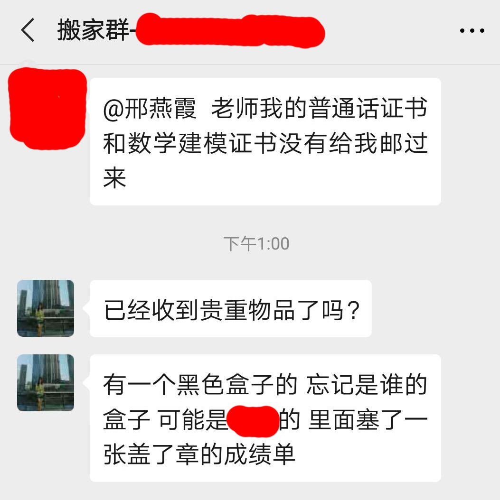 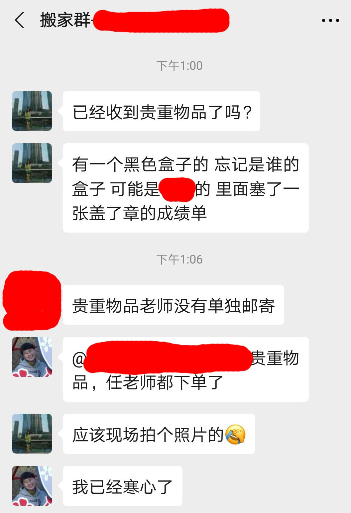

* 注：图中表达寒心的是路翠翠老师。

同学们发出了一些调侃：

* 你失去的只是点不值钱的东西，老师可是心都寒了啊。
* 老师们为了避免我们触景生情看到宿舍过于伤感，直接避免了让我们看到收拾过的宿舍。

下午5点，学院所有本硕博毕业生行李全部打包完成，有不少同学选择将行李留在宿舍内。

### 7月4日 周六

有部分同学开始收到邮寄的行李，并且出现了部分贵重物品（显卡等）丢失的情况。

### 7月5日 周日

当天，学校所有学院均已完成行李打包和邮寄工作。

晚上，学校官方公众号发布推送[央视、新华社等镜头下的北理工毕业“寄”，疫情挡不住母校情](https://mp.weixin.qq.com/s/V5G5DEOnRSmZ1BHEMuOC-A)，可以看出：

* 学校那么着急地完成打包邮寄，并且立即进行宣传，是希望成为北京高校中较早完成行李打包邮寄的高校，为自己争光。
* 即便从官方给出的视频中，仍然看到了存在打包不完善的情况：
  * 有些纸箱内的物品明显超出了纸箱所能容纳的体积，导致纸箱无法封闭。
  * 很多纸箱没有使用足够多的胶带粘牢，运输过程中可能发生破裂。

结合25号学院书记王晶晶希望学生要有大局和总体观念、把更多精力放在自己如何为此贡献和尽力，而自己却不解决实际问题的态度来看，不禁让同学们觉得，**某些参与人员只顾自己，完全不考虑学生利益**。

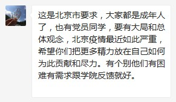

## 可行性分析

先说劳动力。就以某学院有二百名毕业生为例，导员班主任加上几个在校研究生，使劲往多里算，就算二十个人，那么相当于一个人要管十个人也就是两个宿舍的物品邮寄。

再说工作量。相信很多同学都有从良乡搬到中关村的经历。搬家的时候，**很多同学都是提前几天就开始归置收拾了**，我们往少了算，一个同学一刻不停地收拾自己的东西应该最少需要一天。

需要注意，这个一天的时间，是在你很熟悉自己物品存放，很熟悉物品的特性以及运输注意事项，并且可以现场决定如何取舍的情况下，打包一个人物品的最短时间。然而更重要的是，因为只需要校车运输，我们根本不用做很多防冲击的准备，也就是说在包装上并不需要花什么心思。

那么现在的寄快递，与之前搬家至少有如下不同：

1. 负责打包的人需要精细地用泡膜包裹每件怕磕碰的物品，以应对暴力快递的冲击，**比搬家时的要求要高很多很多**。女生的瓶瓶罐罐在搬家时不用单独包装，但是快递就必须要每个瓶子单独包装了
2. 因为所谓的“一人一策”，负责打包的人并不清楚物品的摆放和取舍，**需要逐一与学生进行视频确定**，每个学生有上百件物品都是很正常的，以我为例，可能超过三百件
3. 现在比起之前搬家，已经又过了一年或两年，**宿舍物品数目在这一两年间进一步增加，甚至可能翻倍**
4. 负责打包的人只是学校的老师导员，并不会了解各种各样的私人物品有什么注意事项，应当如何打包。就以最常见的电脑主机为例，**非专业人士现场学习拆解打包，一台两小时能完成吗？** 几千元的显示器如果没有专门的箱子运输，磕一下就报废，如何解决？

根据这些不同，**可以看到对于一个学生来说，工作量比搬家时会增加不只两倍，也就是最少两天的时间**。

换一个计量单位，当时我们宿舍搬家时使用了两卷30米的泡膜，两卷宽胶带，才将东西勉强包裹成可以进行一次小心的运输的程度。如果要是打包成可以快递的程度，每个人恐怕都要用这些。可以想象一下一个人打包用掉几十米泡膜需要多久？两天恐怕不够。

**那么现在简单算一笔账，一个人负责十个人的物品邮寄的情况下，一天不停地干，二十天干的完吗？如果要是像学生自己那样对待这些物品，恐怕二十天都不止。而如今要在几天之内完成这些任务，有任何可行性吗？**

简单地来说，制定政策的领导们可能并不了解新时代大学生宿舍物品的惊人数目以及高昂价值，这也可以理解。我的父辈当年大学毕业，一个尼龙袋子装衣服，另一个装点书本，一手提一个，坐上绿皮火车就回家了。如果我们仍然在那个时代，那么学校打包可能只需要两三天就能完成。

可是得益于祖国这几十年的飞速发展，人民富了起来，物质生活和精神生活都有了极大的改善。大多数同学的宿舍里，不会像三十年前那样只有点不值钱的衣服和书了。同学们宿舍的物品总价值大都在五位数甚至六位数，**数目及种类之繁多已不是父辈当年可以想象**。

即便抛开价格不谈，物质的满足也激发了精神需求的增长，男女朋友手工做的小礼物，父母给的珍贵纪念品，四年时间制作的手账等等，**更多物品的价值完全无法用价格衡量。在这种情况下，打包寄送的要求和工作量已然和当年不在同一个量级之内**。

希望校领导能够先调查估计工作量，而后再制定合理的政策。**如此草率地将任务直接层层安排下去还说什么“一人一策”，其后果要么是让我们的老师长出三头六臂，要么就是只能逼他们草草收拾，在几天之内强行完成原本二十天都完不成的工作量**。最终七八千人总价上亿的资产被随意打包寄送，坏的坏丢的丢，**造成的物损至少在百万级别**。

个人愚见，就是让不怕产生物损或者急需寄回的同学将物品寄回，而不希望寄回的同学，则将物品仍然留在宿舍里，待新生入住前两周再行处理。这样既可以减少工作量，又可以避免物损产生的纠纷。**毕竟，一个有纪念意义或是价值几百元的小物件对于一个学生的价值，可能不会低于一辆轿车对于一个老师的价值**。那么强行转移财物清空宿舍的后果，就可以类比将老师们的私家车砸了的后果，谁都不想四年读下来给被迫给母校“抹了黑”。

## 已经邮寄的其他学校的情况

直接上图：

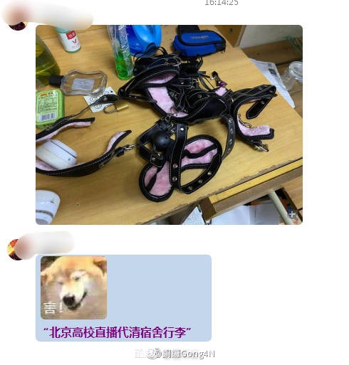 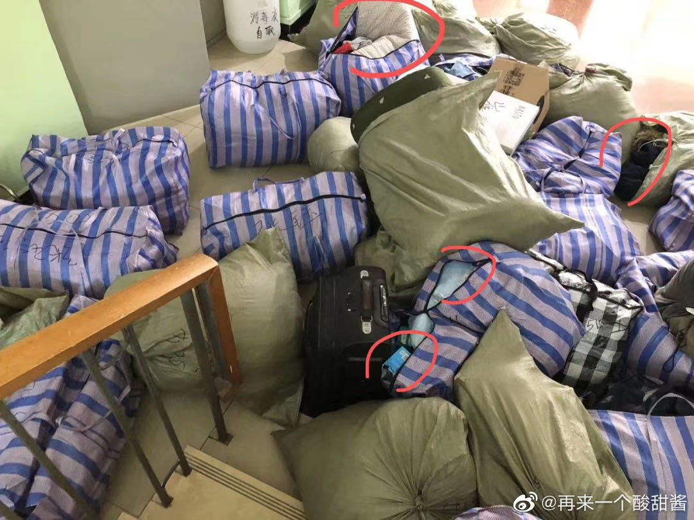 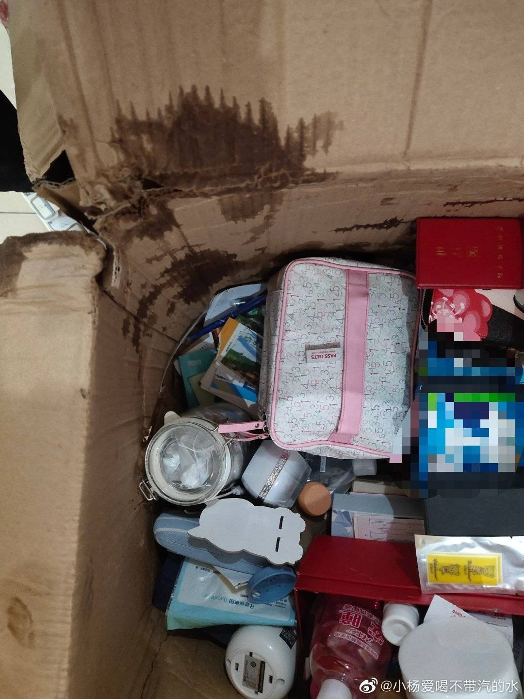 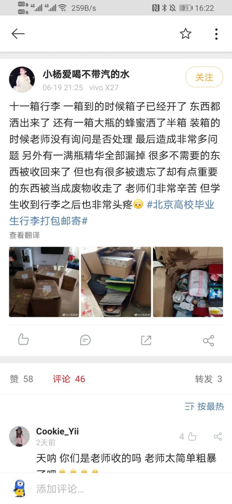

这也就是为什么同学们希望学校能够进行调研工作，确保工作量和窗口时间合理，确保给出赔偿方案，并且尽可能保证学生的隐私安全。

## 相关讨论

其他相关知乎问题：（部分已被限流）

* [高校强制邮寄毕业年级行李，邮费自理且不对丢失损坏承担任何责任，作为学生该怎么办？](https://www.zhihu.com/question/395679963)
* [如何看待国科大部分学院暂时的通知，给本届集中教学的学生邮寄寝室物品？](https://www.zhihu.com/question/397512575)
* [大家如何看待一些大学让省内毕业生帮室友寄行李的行为？](https://www.zhihu.com/question/398799257)
* [如何看待应届毕业生不允许回学校取行李，而是采取邮寄的方式处理，同时要求学生放弃被子等大件行李的安排？](https://www.zhihu.com/question/400853955)
* [如何评价北京师范大学计划给全体毕业生行李打包邮寄的行为？](https://www.zhihu.com/question/402030800)
* [如何看待北京高校遣返毕业生，一刀切邮寄寝室行李的行为？](https://www.zhihu.com/question/402185201)
* [北京高校毕业生，学校会帮忙打包行李，但是我宿舍里有不可描述之物，被发现就会社会性死亡，请问如何是好？](https://www.zhihu.com/question/402110726)
* [如何看待中国矿业大学（北京）管理学院有关毕业生行李邮寄的安排？](https://www.zhihu.com/question/402176771)（目前该问题似乎已经解决）
* [怎样才能让北京高校不要统一打包邮寄毕业生行李，延迟返校让学生自己收拾？](https://www.zhihu.com/question/402152578)
* [从法律的角度如何让北京高校对因强制邮寄毕业生行李物品造成的损坏进行赔偿？](https://www.zhihu.com/question/402330305)
* [如何看待长春理工大学强制将毕业生物品于7月4号前寄走？](https://www.zhihu.com/question/402314358)
* [如何看待北京理工大学的学生就强制寄送宿舍行李的问题与学校在知乎上进行斗争？](https://www.zhihu.com/question/402446731)

微博相关话题：（部分已被屏蔽）

* [\#北京高校刷墙\#](https://s.weibo.com/weibo?q=%23%E5%8C%97%E4%BA%AC%E9%AB%98%E6%A0%A1%E5%88%B7%E5%A2%99%23)
* [\#拒绝行李统一邮寄\#](https://s.weibo.com/weibo?q=%23%E6%8B%92%E7%BB%9D%E8%A1%8C%E6%9D%8E%E7%BB%9F%E4%B8%80%E9%82%AE%E5%AF%84%23)
* [\#北京高校毕业生行李打包邮寄\#](https://s.weibo.com/weibo?q=%23%E5%8C%97%E4%BA%AC%E9%AB%98%E6%A0%A1%E6%AF%95%E4%B8%9A%E7%94%9F%E8%A1%8C%E6%9D%8E%E6%89%93%E5%8C%85%E9%82%AE%E5%AF%84%23)

其他相关讨论：

* [北大未名BBS - 拒绝行李统一打包！毕业生返校收拾的权利都没有吗？](https://bbs.pku.edu.cn/v2/post-read.php?bid=1465&threadid=17719585)
* [北大未名BBS - 恳请学校明确毕业生申请延迟退宿离校的统一方案](https://bbs.pku.edu.cn/v2/post-read.php?bid=1431&threadid=17722056)
* [北师大同学整理的诉求](https://www.zhihu.com/question/402030800/answer/1301058126)

## 总结

学院书记王晶晶先要求宿舍必须清空，不给出任何理由，学生要求和领导沟通，学工部副部长周明宇向学生解答问题，表示可以自愿选择把行李留存在宿舍，但此后仍然有很多老师坚持要求清空宿舍，各个版本的通知之间存在严重的相互矛盾。实际打包过程中，很多老师都非常认真，但部分老师完全不顾学生，随意丢弃和损坏学生物品。

我相信无论是学校，学院，初衷都是好的，只是在具体执行的过程中，一些参与人员的添油加醋，脑补臆想和官僚作风，把好事办坏了，受害者无非是老师、学生、负责人，真的把事情做坏了的人，又在制造矛盾，让老师和学生，学生和学院对立，教职工学生都有话说不出，这些废物倒是把锅甩得干干净净，让学生们和老师都寒了心。我们不能因为个别部门个别领导的个别举措，就上升到学校如何如何垃圾，我们都希望问题能圆满解决，希望各位老师同学相互理解，希望学校越来越好。

## 反馈渠道

政府层面：

* [北京市教育委员会](http://jw.beijing.gov.cn/)市民服务热线：12345。
* [教育部](http://www.moe.gov.cn/)[投诉举报](http://www.moe.gov.cn/jyb_hygq/hygq_tsjb/201505/t20150520_184529.html)电话：010-66092315/3315，邮箱：12391@moe.edu.cn。
* [国家信访局](http://www.gjxfj.gov.cn/gjxfj/wsxf/A0903index_1.htm)、[北京市网上信访](http://wsxf.xfb.beijing.gov.cn/)。

学校层面：

* 北京理工大学校长信箱：president@bit.edu.cn。
* 张军校长邮箱：buaazhangjun@vip.sina.com（不确定是否仍然在使用）。

物理学院层面：

* 院长姚裕贵邮箱：ygyao@bit.edu.cn。
* 本科生院院长欧阳吉庭邮箱：jtouyang@bit.edu.cn。
* 学院书记王晶晶电话：13811020209。

# 贡献方式

想直接参与该项目

* fork此项目，进行修改，然后提交[Pull request](https://github.com/flyerwg/bit_move_dorm/pulls)
  * 参考：[如何参与Github上的开源项目](https://www.jianshu.com/p/a8de24f8a845)
* 或者：直接在[Issues区](https://github.com/flyerwg/bit_move_dorm/issues)提交你的想法，等待项目的其他参与者采纳

想对问题的解决作出贡献

* 寻找更多的反馈渠道
* 在更多的平台进行发声
